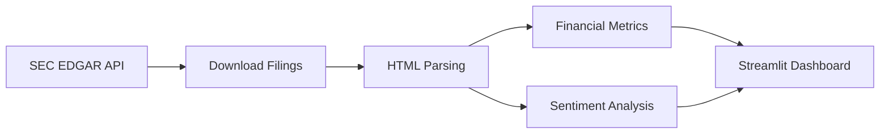
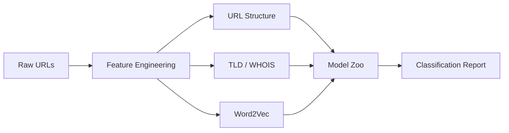

# AI Lab

Collection of machine learning experiments covering classification, NLP-based financial analysis, and cybersecurity.

## Notebooks

### 1. UCI Dataset Classification (`Assignment_AI_1.ipynb`)

Exploratory data analysis and classification on a UCI ML dataset. Includes feature correlation heatmaps, data preprocessing, and model training with evaluation metrics.

### 2. SEC EDGAR Financial Analysis (`edgar_1.ipynb`)

Automated pipeline for downloading SEC filings from EDGAR, parsing 10-K/10-Q reports with BeautifulSoup, extracting financial metrics, and running sentiment analysis with TextBlob. Includes a Streamlit dashboard for interactive exploration.



### 3. Malicious URL Detection (`Malicious_URL_Detection_V1.ipynb`)

Comprehensive URL classification pipeline using 15+ ML models (XGBoost, LightGBM, CatBoost, Random Forest, SVM, MLP, etc.). Features include URL structural analysis, TLD extraction, WHOIS lookups, Word2Vec embeddings, and ensemble evaluation with confusion matrices and WordCloud visualizations.



## Project Structure

```
AI-LAB/
├── Assignment_AI_1.ipynb              # UCI dataset classification
├── edgar_1.ipynb                      # SEC EDGAR financial analysis
├── Malicious_URL_Detection_V1.ipynb   # URL threat detection
└── README.md
```

## Tech Stack

| Area | Libraries |
|------|-----------|
| ML | scikit-learn, XGBoost, LightGBM, CatBoost |
| NLP | TextBlob, gensim (Word2Vec), NLTK |
| Data | pandas, NumPy, BeautifulSoup |
| Visualization | matplotlib, seaborn, Plotly, WordCloud |
| Financial | sec-edgar-downloader, Streamlit |

## License

MIT
